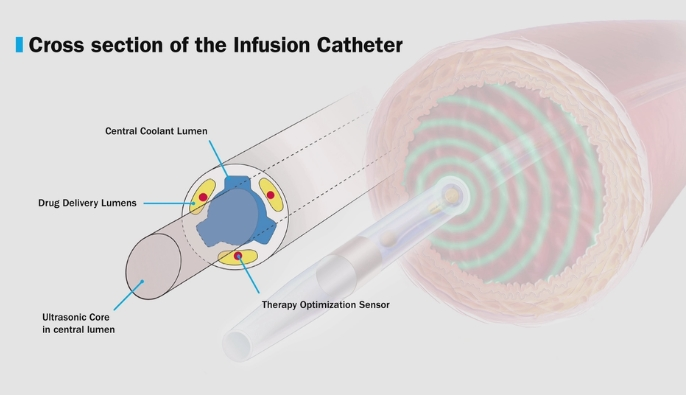

# Catheter Defect Inspection Preprocessing


카테터 단면 이미지 전처리 및 템플릿 오버레이 확인용 스크립트 모음이며, 연구 중 입니다.

## 프로그램 소개
이 프로젝트는 카테터 단면 이미지를 학습/분석에 활용하기 쉬운 형태로 정렬하는 전처리 도구와,
전처리된 이미지를 활용한 CNN 기반 카테터 타입 분류 실험 파이프라인을 포함합니다.

- 전처리 파이프라인: 템플릿 기준 정렬 및 단계별 결과 저장
- 분류 실험 파이프라인: 8개 pretrained CNN 모델 × 2종 전처리(original/holealign) 비교 실험, 5-fold 교차검증, 회전 강건성 평가

민감할 수 있는 세부 파라미터나 내부 기준값은 문서에 상세히 기재하지 않고,
실행 흐름과 사용 목적 중심으로만 안내합니다.

## 최근 변경 사항 요약
- ResNet18, ResNet50, DenseNet121, DenseNet201, EfficientNetB0, MobileNetV2, GoogLeNet, InceptionV3 8개 모델 파인튜닝 파이프라인(`scripts/fine-tuning/`)을 추가했습니다.
- `original` / `holealign` 전처리 두 종류를 동일 조건으로 학습·비교하는 실험 구조를 구성했습니다.
- 5-fold 교차검증 학습·추론·집계 자동화 스크립트를 추가했습니다.
- 회전 강건성 평가용 랜덤 회전 이미지 생성 스크립트(`scripts/generate_original_rr.py`)를 추가했습니다.
- 전처리 지표 CSV 공통 모듈(`scripts/preprocess_metrics.py`)을 추가했습니다.
- k-fold 분석 결과 및 논문용 테이블을 `notebooks/kfold_cross_validation_analysis.ipynb`에 정리했습니다.
- (전처리) 템플릿 전처리와 source 전처리를 분리하고, source 공용 진입점을 `scripts/preprocess_source.py`로 정리했습니다.

## 사용된 방식(요약)
- 템플릿 endpoint 이미지에서 외곽/section/lumen mask를 생성
- source 이미지를 템플릿 좌표계에 맞게 scale + shift
- source lumen mask와 template lumen mask의 IoU 기반으로 최적 회전각 탐색
- 단면 전체가 crop 안에 들어오도록 자동 축소 후 최종 결과 저장
- 템플릿 전체 좌표계 위에 오버레이하여 정렬 상태 시각적 확인

`pro1`, `pro2`, `pro3`는 단면 형태가 달라 동일 파이프라인 틀을 유지하되,
각 타입에 맞는 정렬 로직을 개별 스크립트에서 적용합니다.

## 주요 스크립트
- `scripts/preprocess_template.py`
  - `pro1/pro2/pro3` endpoint 템플릿 전처리
  - grayscale, binary, outer mask, section mask, lumen mask 저장
- `scripts/preprocess_source.py`
  - 공용 source 전처리 진입점
  - 타입별 `holealign` 스크립트를 import 해서 실행
  - `--catheter-type`, `--template`, `--stage-dir` 등을 공통으로 받음
- `scripts/preprocess_pro1_holealign.py`
  - `pro1`용 2-hole 정렬 파이프라인
  - 밝은 outer 후보 검출 + hole permutation 허용 회전 정렬
- `scripts/preprocess_pro2_holealign.py`
  - `pro2`용 3-lumen 정렬 파이프라인
  - big 1개 + small 2개 구조를 사용하는 회전 정렬
- `scripts/preprocess_pro3_holealign.py`
  - `pro3`용 4-lumen 정렬 파이프라인
  - big 2개 + small 2개 구조를 사용하는 회전 정렬
- `scripts/preprocess_pro3_source.py`
  - 예전 `pro3` source 전용 스크립트
  - 현재 권장 진입점은 `scripts/preprocess_source.py`
- `scripts/generate_original_rr.py`
  - original 이미지를 임의 각도로 회전하여 회전 강건성 평가용 데이터셋 생성
  - seed 기반 재현 가능, rotation metadata CSV 저장
- `scripts/preprocess_metrics.py`
  - 전처리 파이프라인 metrics CSV 필드 정의 및 공통 I/O 유틸리티 모듈

## 분류 실험 개요

`pro1`, `pro2`, `pro3` 3-class 분류를 기반으로 아래 두 가지 비교 실험을 수행합니다.

- **전처리 비교**: `original` 이미지 vs `holealign` 전처리 이미지로 동일 모델 학습 후 accuracy/macro-F1 비교
- **회전 강건성 평가**: 학습된 모델을 랜덤 회전된 이미지(`original_rr`)에 적용해 전처리가 회전 불변성에 미치는 영향 측정

실험 대상 모델 (pretrained backbone, feature extractor freeze):

| 모델 | 단일 분할 | 5-fold |
|------|:---------:|:------:|
| ResNet18 | O | O |
| ResNet50 | O | O |
| DenseNet121 | O | O |
| DenseNet201 | O | O |
| EfficientNetB0 | O | O |
| MobileNetV2 | O | O |
| GoogLeNet | O | - |
| InceptionV3 | O | O |

## 주요 분류 스크립트 (`scripts/fine-tuning/`)

- `{Model}.py`: 모델 정의, 데이터셋 로드, split CSV 기반 샘플 수집
- `{Model}_train.py`: 학습 실행, `test_metrics.json` / `training_history.csv` / `best_model.pth` 저장
- `{Model}_inference.py`: 체크포인트 로드 후 이미지 디렉토리 추론, predictions CSV 저장
- `create_kfold_splits.py`: stratified k-fold 분할 CSV 생성
- `run_kfold_training.py`: 모델·fold 조합 학습 자동화
- `run_kfold_inference.py`: 모델·fold 조합 추론 자동화
- `summarize_kfold.py`: fold별 `test_metrics.json`을 읽어 accuracy/macro-F1/loss 집계
- `summarize_kfold_inference.py`: fold별 추론 predictions CSV를 읽어 accuracy/F1 집계

## 실험 구조

```
experiments/
├── {model}_{dataset}_freeze/          # 단일 분할 실험
│   ├── best_model.pth                 # 모델 가중치 (.gitignore)
│   ├── test_metrics.json              # 테스트 결과 (accuracy, macro-F1 등)
│   ├── test_predictions.csv           # 샘플별 예측 결과
│   ├── training_history.csv           # epoch별 학습 이력
│   └── original_rr_predictions.csv   # 랜덤 회전 이미지 추론 결과
├── kfold/
│   ├── {model}_{dataset}_5fold_freeze/
│   │   ├── fold_1/ … fold_5/          # fold별 best_model.pth + 추론 결과
│   │   ├── original_rr_predictions_fold_metrics.csv
│   │   └── original_rr_predictions_summary.csv
│   ├── kfold_fold_metrics.csv         # 전체 fold 집계
│   └── kfold_summary.csv             # 모델별 mean ± std 요약
└── splits/
    ├── {model}_3class_seed42.csv      # 단일 분할 CSV
    └── kfold/
        ├── original_5fold_seed42/     # fold_1~5.csv + fold_summary.csv
        └── original_holealign_5fold_seed42/

```

## 노트북 (`notebooks/`)

| 파일 | 설명 |
|------|------|
| `cnn.ipynb` | CNN 분류 초기 학습·탐색 노트북 |
| `model_performance_analysis.ipynb` | 단일 분할 실험 모델 성능 비교 분석 |
| `kfold_cross_validation_analysis.ipynb` | 5-fold 교차검증 결과 분석 및 논문용 테이블·그래프 생성 |

`notebooks/analysis_outputs/`: 단일 분할 실험 결과 시각화
`notebooks/kfold_analysis_outputs/`: k-fold 분석 결과 및 논문용 테이블

## 템플릿 전처리 출력
- 템플릿 전처리 결과는 `data/processed/processed_templates/<type>_endpoint` 에 저장됩니다.
- 공통 저장 항목
  - `01_*_grayscale.png`
  - `02_*_binary.png`
  - `03_*_main_component.png`
  - `04_*_outer_mask.png`
  - `05_*_section_mask.png`
- lumen mask 저장 항목
  - `pro1`: `06_*_lumen_hole1_mask.png`, `07_*_lumen_hole2_mask.png`, `08_*_lumen_all_mask.png`
  - `pro2`: `06_*_lumen_big_mask.png`, `07_*_lumen_small_mask.png`, `08_*_lumen_all_mask.png`
  - `pro3`: `06_*_lumen_big_mask.png`, `07_*_lumen_small_mask.png`, `08_*_lumen_all_mask.png`

## Source 전처리 출력
- 최종 전처리 이미지
  - `data/processed/processed_images/pro1_holealign`
  - `data/processed/processed_images/pro2_holealign`
  - `data/processed/processed_images/pro3_holealign`
- 템플릿 오버레이 이미지
  - `data/processed/overlay_images/pro1_holealign`
  - `data/processed/overlay_images/pro2_holealign`
  - `data/processed/overlay_images/pro3_holealign`
- 단계별 중간 결과
  - `data/processed/stage_images/pro1_holealign`
  - `data/processed/stage_images/pro2_holealign`
  - `data/processed/stage_images/pro3_holealign`

대표 산출물:
- 공통
  - `01_*_grayscale.png`
  - `02_*_outer_mask.png`
  - `03_*_section_mask.png`
  - `04_*_placed_gray.png`
  - `10_*_aligned_gray.png`
  - `11_*_aligned_outer_mask.png`
  - `12_*_aligned_section_mask.png`
  - `16_*_final_crop_600.png`
  - `17_*_template_overlay.png`
- lumen 단계
  - `pro1`: `07_*_lumen_hole1_mask.png`, `08_*_lumen_hole2_mask.png`, `09_*_lumen_all_mask.png`
  - `pro2`: `07_*_lumen_big_mask.png`, `08_*_lumen_small_mask.png`, `09_*_lumen_all_mask.png`
  - `pro3`: `07_*_lumen_big_mask.png`, `08_*_lumen_small_mask.png`, `09_*_lumen_all_mask.png`

오버레이에서:
- 템플릿 중심: 빨간 `cross`
- 정렬된 마스크 중심: 노란 `tilted cross`

## 환경
|속성|버전|
|------|---|
|**OS**|Ubuntu 24.04.4 LTS (nobel)|
|**Python**|3.10 +|
|**CUDA**|12.8|
|**cuDNN**|9.14.0.64|
|**OpenCV**|4.13.0 (`cv2`)|
|**NumPy**|2.4.3|
|**PyTorch**|2.9.1+cu126|
|**torchvision**|0.24.1+cu126|
|**scikit-learn**|1.8.0|
|**pandas**|3.0.2|
|**Pillow**|12.1.1|
|**venv**|`miniforge3` or `conda`|

## 실행 예시
```bash
conda run -n catheter python scripts/preprocess_template.py
conda run -n catheter python scripts/preprocess_source.py --catheter-type pro1 --alpha 0.55
conda run -n catheter python scripts/preprocess_source.py --catheter-type pro2 --alpha 0.55
conda run -n catheter python scripts/preprocess_source.py --catheter-type pro3 --alpha 0.55
```

## `preprocess_source.py` 실행 인자 예시
```bash
conda run -n catheter python scripts/preprocess_source.py \
  --catheter-type pro3 \
  --input-dir /home/hjj747/catheter-defect-inspection/data/raw/targets/pro_3 \
  --pattern "*.png" \
  --template /home/hjj747/catheter-defect-inspection/data/processed/processed_templates/pro3_endpoint \
  --output-dir /home/hjj747/catheter-defect-inspection/data/processed/processed_images/pro3_holealign \
  --overlay-dir /home/hjj747/catheter-defect-inspection/data/processed/overlay_images/pro3_holealign \
  --stage-dir /home/hjj747/catheter-defect-inspection/data/processed/stage_images/pro3_holealign \
  --alpha 0.55
```

주요 인자:
- `--catheter-type`: `pro1`, `pro2`, `pro3`, `auto`
- `--input-dir`: source 이미지 폴더
- `--template`: 전처리된 템플릿 결과 폴더
- `--output-dir`: 최종 전처리 이미지 저장 폴더
- `--overlay-dir`: 템플릿 오버레이 이미지 저장 폴더
- `--stage-dir`: 단계별 중간 결과 저장 폴더
- `--no-stage-images`: 단계별 중간 결과 저장 비활성화
- `--no-overlay`: 오버레이 저장 비활성화
- `--crop-size`: 최종 crop 크기
- `--alpha`: 오버레이 투명도

## 해결된 주요 문제
- 템플릿 lumen mask가 grayscale threshold 의존으로 왜곡되던 문제를 `section - outer` 기반 생성으로 정리
- 템플릿 전처리 결과를 source 파이프라인에서 재계산하던 중복 제거
- `600x600` crop에서 단면 일부만 보이던 문제를 자동 축소 후 crop으로 개선
- 오버레이가 crop/축소본 기준으로 생성되던 문제를 템플릿 전체 기준 오버레이로 수정
- 템플릿 중심과 정렬된 마스크 중심이 일치하는지 한눈에 확인할 수 있도록 마커 추가

## 참고 이미지 출처
- 카테터 단면 결함 검사 이해를 돕기 위한 이미지 출처:
  [https://www.mtnews.net/news/articleView.html?idxno=16856](https://www.mtnews.net/news/articleView.html?idxno=16856)

## 참고
- 대용량 데이터(`data/raw`, `data/processed`, `data/dataset`)와 가중치(`weights`, `*.pth`)는 `.gitignore`로 제외되어 있습니다.
- `experiments/` 디렉토리의 모델 가중치(`best_model.pth`)도 `.gitignore`로 제외되어 있으며, 실험 결과 CSV/JSON만 추적됩니다.

## License
This project is licensed under the MIT License. See [LICENSE](./LICENSE).
